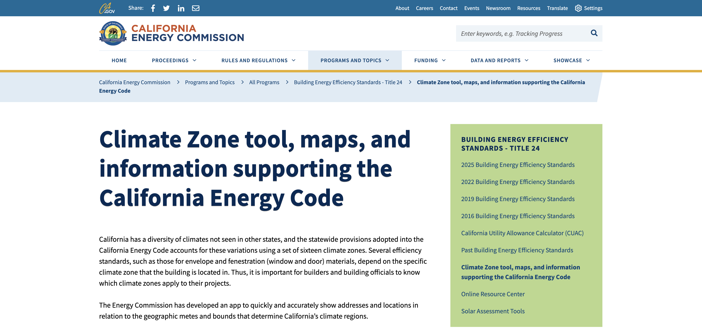

# README

# Data Source

https://www.energy.ca.gov/programs-and-topics/programs/building-energy-efficiency-standards/climate-zone-tool-maps-and

# Data Overview

This data layer for Building Climate Zones is hosted by the California Energy Commission. These climate zones are specifically referenced within the context of the California Energy Code.

## Data Description
Building Climates Zones of California Climate Zone Descriptions for New Buildings - California is divided into 16 climatic boundaries or climate zones, which is incorporated into the Energy Efficiency Standards (Energy Code). Each Climate zone has a unique climatic condition that dictates which minimum efficiency requirements are needed for that specific climate zone.

The numbers used in the climate zone map don't have a title or legend. The California climate zones shown in this map are not the same as what we commonly call climate areas such as "desert" or "alpine" climates. The climate zones are based on energy use, temperature, weather and other factors.

This is explained in the Title 24 energy efficiency standards glossary section:

"The Energy Commission established 16 climate zones that represent a geographic area for which an energy budget is established. These energy budgets are the basis for the standards...." "(An) energy budget is the maximum amount of energy that a building, or portion of a building...can be designed to consume per year."

"The Energy Commission originally developed weather data for each climate zone by using unmodified (but error-screened) data for a representative city and weather year (representative months from various years). The Energy Commission analyzed weather data from weather stations selected for (1) reliability of data, (2) currency of data, (3) proximity to population centers, and (4) non-duplication of stations within a climate zone.

"Using this information, they created representative temperature data for each zone. The remainder of the weather data for each zone is still that of the representative city." The representative city for each climate zone (CZ) is:

CZ 1: Arcata
CZ 2: Santa Rosa
CZ 3: Oakland
CZ 4: San Jose-Reid
CZ 5: Santa Maria
CZ 6: Torrance
CZ 7: San Diego-Lindbergh
CZ 8: Fullerton
CZ 9: Burbank-Glendale
CZ10: Riverside
CZ11: Red Bluff
CZ12: Sacramento
CZ13: Fresno
CZ14: Palmdale
CZ15: Palm Spring-Intl
CZ16: Blue Canyon
The original detailed survey definitions of the 16 Climate Zones are found in the 1995 publication, "California Climate Zone Descriptions for New Buildings."

# Data Dictionary

Table: ca_building_climate_zones_2021

| Data Field	    | Definition |
|-------------------|------------|
| FID | OGC FID (Autogenerated) |
| geom | Geometries |
| objectid | Object ID Index |
| bzone | Building Zone ID |
| bacerage | Building Zone Acerage |
