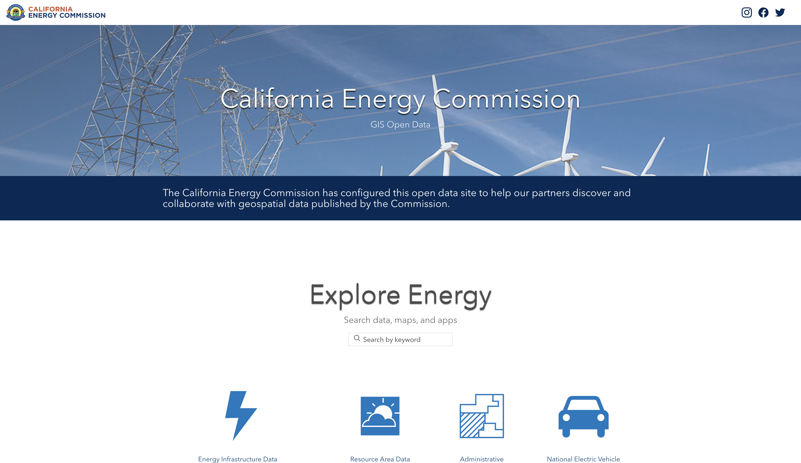

# README

# Data Source

https://www.energy.ca.gov/programs-and-topics/programs/building-energy-efficiency-standards/climate-zone-tool-maps-and

# Data Overview

Data layers for Electric Utility and other Load Serving Entity Service Territories are hosted by the California Energy Commission. These layers encompass the state's Investor Owned Utilities, Municipally/Publicly Owned Utilities, as well as other Electric Cooperatives and Load Serving Entities established throughout the state.

## Data Description

Data compiled from California Energy Commission staff from georeferenced electric territory maps and the United States Department of Homeland Security, Homeland Infrastructure Foundation-Level Data (HIFILD), https://hifld-geoplatform.opendata.arcgis.com/datasets/geoplatform::electric-retail-service-territories/about.

Boundaries are approximate, for absolute territory information, contact the appropriate load serving entity. Not all electric load serving entities are represented, if you have information on missing territory locations, please contact GIS@energy.ca.gov.

For more information on California Load Serving Entities visit  this website: https://www.energy.ca.gov/data-reports/energy-almanac/california-electricity-data/electric-load-serving-entities-lses

Last Updated June, 2021

# Data Dictionary

Table: ca_electric_utilities_2022

| Data Field	    | Definition |
|-------------------|------------|
| FID | OGC FID (Autogenerated) |
| geom | Geometries |
| objectid | Object ID Index |
| acronym | Utility Acronym |
| utility | Utility Name |
| type | Type of Load Serving Entity |
| url | Website URL |
| phone | Telephone Number |
| address | Mailing Address |
| hifld_id | Department of Homeland Security Homeland Infrastructure Foundation Level Data Identification Number |

Table: ca_electric_load_serving_entities_2022

| Data Field	    | Definition |
|-------------------|------------|
| FID | OGC FID (Autogenerated) |
| geom | Geometries |
| objectid | Object ID Index |
| acronym | Utility Acronym |
| utility | Utility Name |
| type | Type of Load Serving Entity |
| url | Website URL |
| phone | Telephone Number |
| address | Mailing Address |
| hifld_id | Department of Homeland Security Homeland Infrastructure Foundation Level Data Identification Number |
