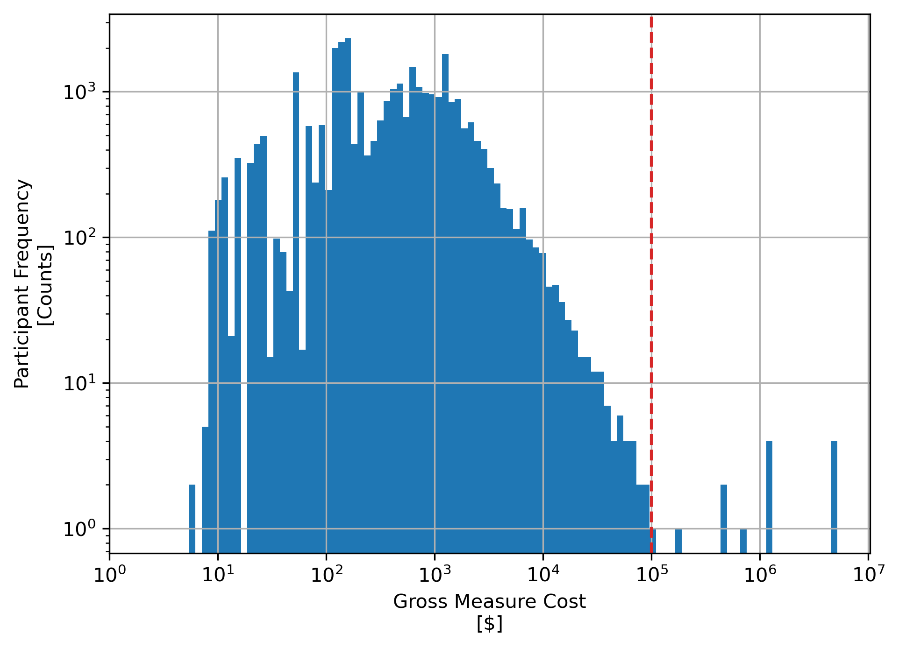

# Data Source

https://cedars.sound-data.com/

# Data Overview

- TBA

# Data Description

- TBA

## Important Notes

* Raw CEDARS program claims data were preprocessed to extract fuel switching programs. This was done by matching the listed measure types in the program claim attributes to keywords that were deemed to be associated with fuel switching measures (i.e. 'heat-pump', 'gas replacement', 'panel upgrades', etc.) Extracting relevant records involved an interative process of sampling and filtering the measure type descriptions within each vintage year of claim data.
* Once relevant fuel switching program claims were extracted, additional filtering was performed on the basis of values in the 'Gross Measure Cost' attribute column. Inspection of these values revealed that there were a small number of claims, with 'Gross Measure Costs' that were either non-sensical - i.e. negative dollar amounts - or unreasonably high - i.e. greater than 1 million dollars per claim. This latter situation is illustrated in the histogram plot provided which was generated for the initial subset of fuel-substitution claims generated from the previous filtering operation. On the basis of this frequency distribution shown in this plot, the decision was taken to discard claims whose 'Gross Measure Cost' was greater than $100,000 - plotted with the broken red vertical line - as these are either likely not indicative of a 'typical' residential/small commercial fuel-switching project or are otherwise somehow aggregating multiple individual claims into one.

    

# Data Dictionary

Table: ca_building_climate_zones_2021

| Data Field	    | Definition |
|-------------------|------------|
| Claim ID | Claim Identification Number |
| Year | Claim Year |
| PA | Program Administrator |
| Program ID | Program Identification Number |
| Program Name | Program Name |
| Program Group | Program Group |
| Program Sector | Program Sector |
| Financing | Financing Mechanism |
| Program Implementer | Program Implementer |
| Claim Year Quarter | Claim Year Quarter |
| Building Type | Building Type |
| Climate Zone | CEC Building Climate Zone |
| Measure Application Type | Measure Application Type |
| Measure Code | Measure Code |
| Measure Description | Measure Description |
| Measure Impact Type | Measure Impact Type |
| Measure ID | Measure Identification Code |
| Measure Qualifier | Measure Qualifier |
| Measure Technology ID | Measure Technology Identification Code |
| Technology Group | Measure Technology Group Name |
| Use Category | Use Category |
| Use Subcategory | Use Subcategory |
| Number of Units | Number of Units at Measure Implementation Premise |
| Unit Direct Install Labor | Unit Direct Install Labor Cost |
| Unit Direct Install Materials | Unit Direct Install Materials Cost |
| Unit End User Rebate | Unit End User Rebate Value |
| Unit Incentive to Others | Unit Incentive Value to Others |
| Gross Measure Cost | Gross Measure Cost |
| End User Rebate | End User Rebate Value |
| Budget | Budget Value |
| Gross Participant Cost | Gross Participant Cost |
| Net Participant Cost | Net Participant Cost |
