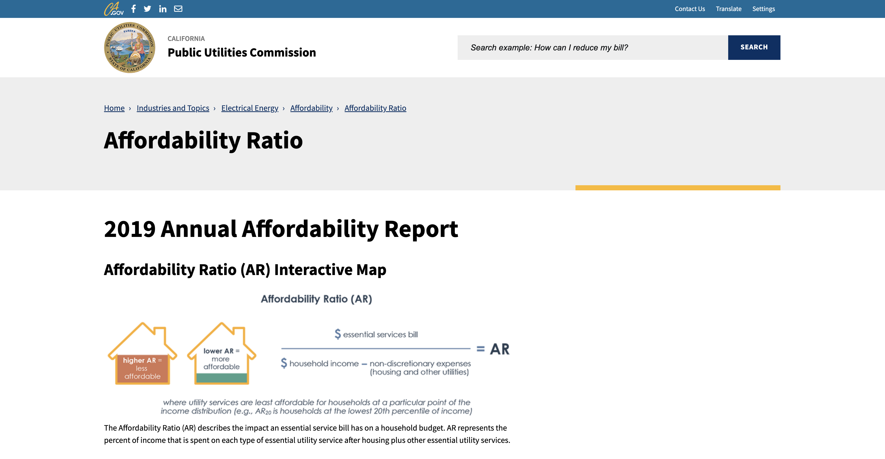

# README

# Data Source

https://www.cpuc.ca.gov/industries-and-topics/electrical-energy/affordability/affordability-ratio

# Data Overview

- TBA

# Data Description
# Areas of Affordability Concern (AAC)

The areas of affordability concern (AAC) for each industry are the geographical areas where the AR20 scores are greater than the affordability demarcations. These demarcations represent the inflection points of the distribution of all AR20 scores across the state. The demarcations are 15% for essential electric and communications services, and 10% of essential gas and water services. The AACs are presented in census tract geography.

# Affordability Ratio (AR)

The Affordability Ratio (AR) metric quantifies the percentage of a representative household’s income that would be used to pay for an essential utility service, after non-discretionary expenses such as housing and other essential utility service charges are deducted from the household’s income.  The higher an AR, the less affordable the utility service.  The AR may be calculated for a single essential utility service, a combination of services, or all essential utility services combined.

# Data Dictionary

- TBA
