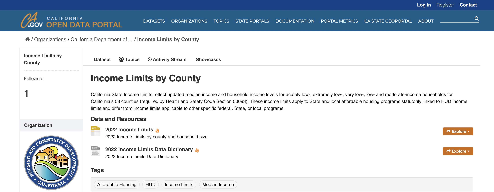

# Data Source

https://data.ca.gov/dataset/income-limits-by-county

# Data Overview

California State Income Limits reflect updated median income and household income levels for acutely low-, extremely low-, very low-, low- and moderate-income households for California’s 58 counties (required by Health and Safety Code Section 50093). These income limits apply to State and local affordable housing programs statutorily linked to HUD income limits and differ from income limits applicable to other specific federal, State, or local programs.

# Data Description

The California Department of Housing and Community Development updates its income limits when the US Department of Housing and Urban development updates its Section 8 program income limits.

In 2013, the California Department of Housing and Community Development (HCD) implemented a State Hold Harmless Policy as a result of the discontinuation of the U.S. Department of Housing and Urban Development’s (HUD’s) long-standing Hold Harmless Policy in 2009. The purpose of HUD’s former Hold Harmless policy was to not allow decreases to county area median income (AMI) and household size income limit figures when annually updating Section 8 income limits. HCD’s Hold Harmless policy, identical to HUD’s former policy, applies to State and local affordable housing programs statutorily linked to HUD income limits.

# Data Dictionary

Table: ca_2022_county_income_limits

|Data Field | Definition |
|-------|------------|
| ogc_fid | Unique Field Identification Number (Autogenerated) |
| county | Name of County |
| ami | Median Income of County |
| ali_1	| 0-15% of a county’s AMI for 1-person households. |
| ali_2	| 0-15% of a county’s AMI for 2-person households. |
| ali_3	| 0-15% of a county’s AMI for 3-person households. |
| ali_4	| 0-15% of a county’s AMI for 4-person households. |
| ali_5	| 0-15% of a county’s AMI for 5-person households. |
| ali_6	| 0-15% of a county’s AMI for 6-person households. |
| ali_7	| 0-15% of a county’s AMI for 7-person households. |
| ali_8	| 0-15% of a county’s AMI for 8-person households. |
| eli_1	| 15-30% of AMI for 1-person households. |
| eli_2	| 15-30% of AMI for 2-person households. |
| eli_3	| 15-30% of AMI for 3-person households. |
| eli_4	| 15-30% of AMI for 4-person households. |
| eli_5	| 15-30% of AMI for 5-person households. |
| eli_6	| 15-30% of AMI for 6-person households. |
| eli_7	| 15-30% of AMI for 7-person households. |
| eli_8	| 15-30% of AMI for 8-person households. |
| vli_1	| 30-50% of AMI for 1-person households. |
| vli_2	| 30-50% of AMI for 2-person households. |
| vli_3	| 30-50% of AMI for 3-person households. |
| vli_4	| 30-50% of AMI for 4-person households. |
| vli_5	| 30-50% of AMI for 5-person households. |
| vli_6	| 30-50% of AMI for 6-person households. |
| vli_7	| 30-50% of AMI for 7-person households. |
| vli_8	| 30-50% of AMI for 8-person households. |
| li_1	| 50-80% of a county’s AMI for 1-person households.	|
| li_2	| 50-80% of a county’s AMI for 2-person households.	|
| li_3	| 50-80% of a county’s AMI for 3-person households.	|
| li_4	| 50-80% of a county’s AMI for 4-person households.	|
| li_5	| 50-80% of a county’s AMI for 5-person households.	|
| li_6	| 50-80% of a county’s AMI for 6-person households.	|
| li_7	| 50-80% of a county’s AMI for 7-person households.	|
| li_8	| 50-80% of a county’s AMI for 8-person households.	|
| mod_1	| 80-120% of a county’s area median income for 1-person households.	|
| mod_2	| 80-120% of a county’s area median income for 2-person households.	|
| mod_3	| 80-120% of a county’s area median income for 3-person households.	|
| mod_4	| 120% of a county’s area median income for 4-person households.	|
| mod_5	| 80-120% of a county’s area median income for 5-person households.	|
| mod_6	| 80-120% of a county’s area median income for 6-person households.	|
| mod_7	| 80-120% of a county’s area median income for 7-person households.	|
| mod_8	| 80-120% of a county’s area median income for 8-person households. |
