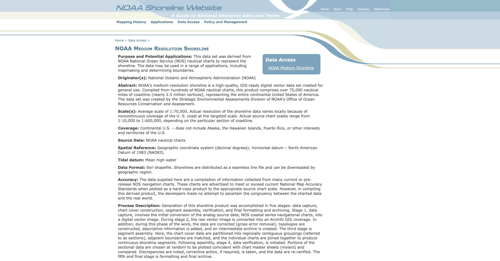

# Data Source

https://shoreline.noaa.gov/data/datasheets/medres.html

# Data Overview

NOAA's medium-resolution shoreline is a high-quality, GIS-ready digital vector data set created for general use. Compiled from hundreds of NOAA nautical charts, this product comprises over 75,000 nautical miles of coastline (nearly 2.5 million vertices), representing the entire continental United States of America. The data set was created by the Strategic Environmental Assessments Division of NOAA's Office of Ocean Resources Conservation and Assessment.

# Data Description

Purpose and Potential Applications: This data set was derived from NOAA National Ocean Service (NOS) nautical charts to represent the shoreline. The data may be used in a range of applications, including mapmaking and determining boundaries.

Originator(s): National Oceanic and Atmospheric Administration (NOAA)

Scale(s): Average scale of 1:70,000. Actual resolution of the shoreline data varies locally because of noncontinuous coverage of the U. S. coast at the targeted scale. Actual source chart scales range from 1:10,000 to 1:600,000, depending on the particular section of coastline.

Coverage: Continental U.S. – does not include Alaska, the Hawaiian Islands, Puerto Rico, or other interests and territories of the U.S.

Source Data: NOAA nautical charts

Spatial Reference: Geographic coordinate system (decimal degrees); horizontal datum – North American Datum of 1983 (NAD83).

Tidal datum: Mean high water

Data Format: Esri shapefile. Shorelines are distributed as a seamless line file and can be downloaded by geographic region.

Accuracy: The data supplied here are a compilation of information collected from many current or pre-release NOS navigation charts. These charts are advertised to meet or exceed current National Map Accuracy Standards when plotted as a hard-copy product to the appropriate source chart scale. However, in compiling this derived product, the developers made no attempt to ascertain the congruency between the charted data and the real world.

Process Description: Generation of this shoreline product was accomplished in five stages: data capture, chart cover construction, segment assembly, verification, and final formatting and archiving. Stage 1, data capture, involves the initial conversion of the analog source data, NOS coastal series navigational charts, into a digital vector image. During stage 2, the raw vector image is converted into an ArcInfo GIS coverage. In addition, during this phase of the work, the data are corrected (gross error removal), topologies are constructed, descriptive information is added, and an intermediate archive is created. The third stage is segment assembly. Here, the chart cover data are partitioned into regionally contiguous groupings (referred to as sections), adjacent boundaries are matched, and the individual charts are joined together to produce continuous shoreline segments. Following assembly, stage 4, data verification, is initiated. Portions of the sectional data are chosen at random to be plotted coincident with chart master sheets (mylars) and compared. Discrepancies are noted, corrective action, if required, is taken, and the data are re-verified. The fifth and final stage is formatting and final archive.

# Data Dictionary

Table: us_medium_shoreline

|Data Field | Definition |
|-------|------------|
| ogc_fid | Unique Field Identification Number (Autogenerated) |
| geom | Linestring Geometry Column |
| s_scale | Effective Scale of Line Segment |
| s_chart | Source Chart Identification Number |
| s_datum | Source Datum |
| s_rev_date | Source Revision Date |
| s_source | Source Identification Number |
| s_arc_code | Source Arc Identification Code |
| s_integrit | Source Integrity Rating Classification Code |
| regions | Source Region Identification Number |
