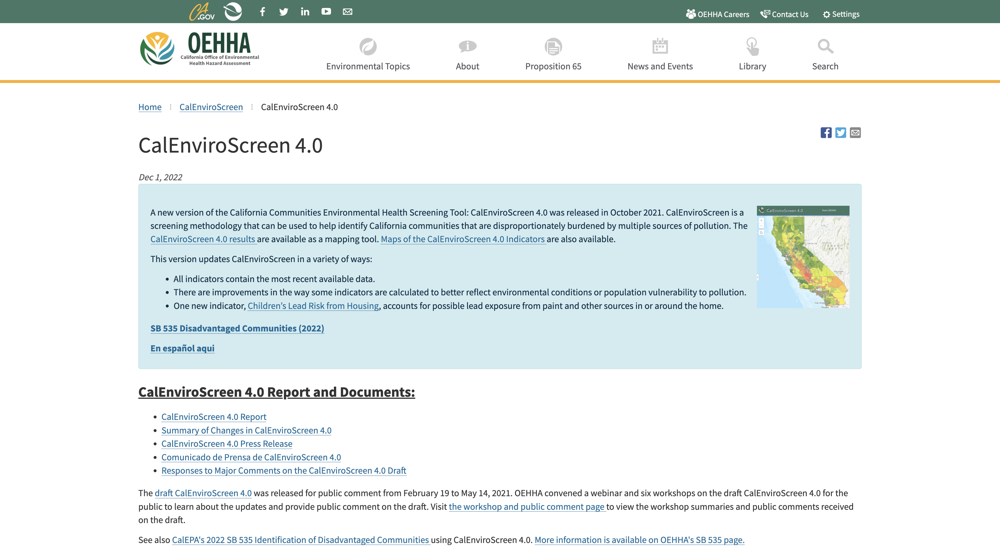

# README.md

# Data Source

https://oehha.ca.gov/calenviroscreen/report/calenviroscreen-40

# Data Overview

# Data Description

# Data Dictionary

Variable Name
Description
   Census Tract
   Total Population
   California County
   ZIP
      Approximate Location
Approximate city, town, or area where each census tract is located based on US Census Incorporated Places (2020, Cities), US Census Designated Places, (2020, Designated Places), and the CA Department of Tax and Fees City and County Boundaries and City Annexations (2021, Unincorporated Areas) boundary files. All tracts that did not fall within one of these boundaries were assigned "unincorporated county area" based on that tract's county. This is for reference purposes only and should not be used to determine whether a census tract falls within a city or town boundary.
   Longitude
Longitude of the centroid of the census tract Latitude of the centroid of the census tract
CalEnviroScreen Score, Pollution Score multiplied by Population Characteristics Score
Percentile of the CalEnviroScreen score
Percentile of the CalEnviroScreen score, grouped by 5% increments Amount of daily maximum 8 hour Ozone concentration
Ozone percentile
Annual mean PM2.5 concentrations
PM2.5 percentile
Diesel PM emissions from on-road and non-road sources
Diesel PM percentile
Drinking water contaminant index for selected contaminants
Drinking water percentile
Potential risk for lead exposure in children living in low-income communities with older housing
Children's lead risk from housing percentile
Total pounds of selected active pesticide ingredients (filtered for hazard and volatility) used in production-agriculture per square mile
Pesticides percentile
Toxicity-weighted concentrations of modeled chemical releases to air from facility emissions and off-site incineration (from RSEI)
   Latitude
   CES 4.0 Score
   CES 4.0 Percentile
   CES 4.0 Percentile Range
   Ozone
   Ozone Pctl
   PM2.5
   PM2.5 Pctl
   Diesel PM
   Diesel PM Pctl
   Drinking Water
   Drinking Water Pctl
   Lead
   Lead Pctl
   Pesticides
   Pesticides Pctl
   Tox. Release
  OEHHA
1
  Tox. Release Pctl
  Traffic
  Traffic Pctl
  Cleanup Sites
  Cleanup Sites Pctl
  Groundwater Threats
  Groundwater Threats Pctl
  Haz. Waste
  Haz. Waste Pctl
  Imp. Water Bodies
  Imp. Water Bodies Pctl
  Solid Waste
  Solid Waste Pctl
  Pollution Burden
  Pollution Burden Score
  Pollution Burden Pctl
  Asthma
  Asthma Pctl
  Low Birth Weight
  Low Birth Weight Pctl
  Cardiovascular Disease
  Cardiovascular Disease Pctl
  Education
  Education Pctl
  Linguistic Isolation
  Linguistic Isolation Pctl
  Poverty
  Poverty
  Unemployment
  Unemployment Pctl
  Housing Burden
  Housing Burden Pctl
  Pop. Char.
  Pop. Char. Score
  Pop. Char. Score Pctl
  Toxic release percentile
Traffic density in vehicle-kilometers per hour per road length, within 150 meters of the census tract boundary
Traffic percentile
Sum of weighted EnviroStor cleanup sites within buffered distances to populated blocks of census tracts
Cleanup sites percentile
Sum of weighted GeoTracker leaking underground storage tank sites within buffered distances to populated blocks of census tracts
Groundwater threats percentile
Sum of weighted hazardous waste facilities and large quantity
generators within buffered distances to populated blocks of census tracts
Hazardous waste percentile
Sum of number of pollutants across all impaired water bodies within buffered distances to populated blocks of census tracts
Impaired water bodies percentile
Sum of weighted solid waste sites and facilities (SWIS) within buffered distances to populated blocks of census tracts
Solid waste percentile
Average of percentiles from the Pollution Burden indicators (with a half weighting for the Environmental Effects indicators)
Pollution Burden variable scaled with a range of 0-10. (Used to calculate CES 4.0 Score)
Pollution burden percentile
Age-adjusted rate of emergency department visits for asthma
Asthma percentile
Percent low birth weight
Low birth weight percentile
Age-adjusted rate of emergency department visits for heart attacks per 10,000
Cardiovascular disease percentile
Percent of population over 25 with less than a high school education Education percentile
Percent limited English speaking households
Linguistic isolation percentile
Percent of population living below two times the federal poverty level
Poverty percentile
Percent of the population over the age of 16 that is unemployed and eligible for the labor force
Unemployment percentile
Percent housing-burdened low-income households
Housing burden percentile
Average of percentiles from the Population Characteristics indicators
Population Characteristics variable scaled with a range of 0-10. (Used to calculate CES 4.0 Score)
Population characteristics percentile
                                   OEHHA
2

Data Dictionary for Demographic Profile Tab
Census Tract ID from 2010 Census
CalEnviroScreen Score, Pollution Score multiplied by Population Characteristics Score
Percentile of the CalEnviroScreen score
Percentile of the CalEnviroScreen score, grouped by 5% increments California county that the census tract falls within
2019 ACS population estimates in census tracts
2019 ACS population estimates of the percent per census tract of children under 10 years old
2019 ACS population estimates of the percent per census tract of people between 10 and 64 years old
2019 ACS population estimates of the percent per census tract of elderly 65 years and older
2019 ACS population estimates of the percent per census tract of those who identify as Hispanic or Latino
2019 ACS population estimates of the percent per census tract of those who identify as non-Hispanic white
2019 ACS population estimates of the percent per census tract of those who identify as non-Hispanic African American or black
2019 ACS population estimates of the percent per census tract of those who identify as non-Hispanic Native American
2019 ACS population estimates of the percent per census tract of those who identify as non-Hispanic Asian or Pacific Islander
2019 ACS population estimates of the percent per census tract of those who identify as non-Hispanic "other" or as multiple races
Variable Name
Census Tract
Description

CES 4.0 Score

CES 4.0 Percentile

CES 4.0 Percentile Range

California County

Total Population

Children < 10 years (%)

Pop 10-64 years (%)

Elderly > 64 years (%)

Hispanic (%)

White (%)

African American (%)

Native American (%)

Asian American (%)

Other/Multiple (%)

OEHHA
3
